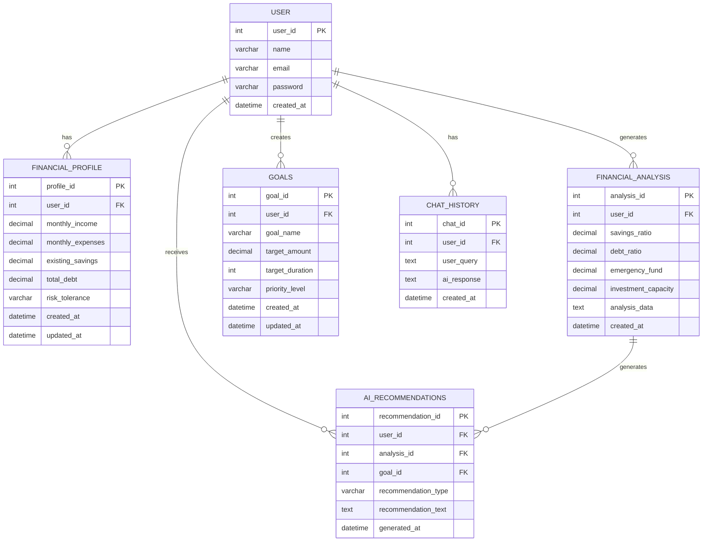

# AI Financial Advisor — ER Diagram

## Entities
- User
- Financial Profile
- Financial Analysis
- Goals
- AI Recommendations
- Chat History

## Primary Keys
- User: user_id
- Financial Profile: profile_id
- Financial Analysis: analysis_id
- Goals: goal_id
- AI Recommendations: recommendation_id
- Chat History: chat_id

## Foreign Keys
- Financial Profile: user_id
- Financial Analysis: user_id
- Goals: user_id
- AI Recommendations: user_id, analysis_id
- Chat History: user_id

## Relationships
- User → Financial Profile: 1:M
- User → Financial Analysis: 1:M
- User → Goals: 1:M
- User → Chat History: 1:M
- User → AI Recommendations: 1:M
- Financial Analysis → AI Recommendations: 1:M
## AIFA Entity Relationship Diagram

